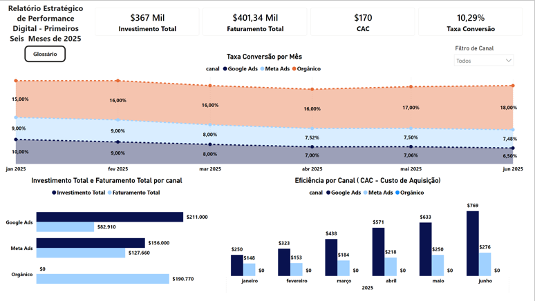
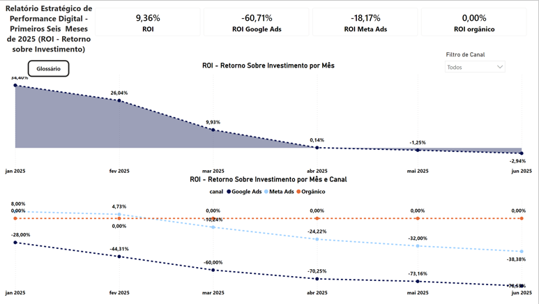
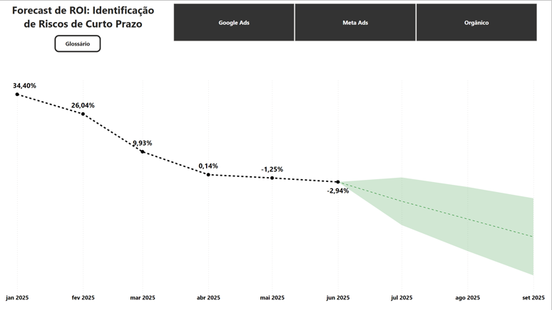

# Digital Performance Strategy - Business Case

##  Contexto do Projeto
Este projeto foi desenvolvido como resolução de um desafio técnico para uma vaga de Análise de Dados. O objetivo principal foi analisar a performance financeira e de aquisição de campanhas de marketing digital de uma empresa fictícia  ao longo do primeiro semestre de 2025.

O painel fornece uma visão gerencial e estratégica, permitindo identificar a eficiência de diferentes canais de aquisição (Google Ads, Meta Ads e Orgânico) e projetar riscos de curto prazo baseados no histórico de Retorno Sobre Investimento (ROI).

## Ferramentas e Tecnologias Utilizadas
* **Excel & Power Query:** Utilizados para a etapa de ETL (Extração, Transformação e Limpeza). Os dados brutos foram importados, tratados, padronizados e modelados para garantir a integridade da base antes da visualização.
* **Power BI:** Ferramenta principal para a modelagem de dados e construção do dashboard interativo.
* **DAX (Data Analysis Expressions):** Criação de medidas calculadas complexas para gerar as métricas de negócio exigidas pelo desafio.

##  Principais Métricas Analisadas (KPIs)
As seguintes métricas foram desenvolvidas via DAX para compor a análise:
* **CPL (Custo por Lead):** Investimento Total / Total de Leads.
* **CAC (Custo de Aquisição de Cliente):** Investimento Total / Total de Vendas.
* **Taxa de Conversão:** (Total de Vendas / Total de Leads) * 100.
* **ROI (Retorno Sobre Investimento):** (Faturamento - Investimento) / Investimento.
* **Forecast de ROI:** Projeção estatística para identificar tendências futuras com base na performance histórica.

##  Principais Insights e Conclusões
Através da análise exploratória dos dados, foi possível extrair os seguintes diagnósticos para a diretoria:

1. **Queda Contínua de Rentabilidade:** O ROI geral do negócio vem caindo drasticamente, saindo de 34,40% em janeiro para um cenário negativo de -2,94% em junho. A projeção (Forecast) indica um risco severo de agravamento dessa métrica para o próximo trimestre caso a estratégia não seja pivotada.
2. **Ineficiência em Canais Pagos:** Analisando a quebra por canal, nota-se que tanto o Google Ads quanto o Meta Ads fecharam o semestre operando no prejuízo, apresentando ROIs de -60,71% e -18,17%, respectivamente. 
3. **Oportunidade no Tráfego Orgânico:** O canal Orgânico foi o grande pilar de sustentação do faturamento no período, apresentando um CAC zerado (alta eficiência) e sendo responsável por equilibrar os prejuízos da mídia paga.

---

## 🖼️ Visualização do Dashboard

### Visão Geral e Saúde do Negócio
Abaixo, a visão geral consolidada dos primeiros seis meses de operação.

### Visão por Canal e Custos de Aquisição (CAC)
Detalhamento de investimento, faturamento e eficiência (CAC) segmentado por Google Ads, Meta Ads e Orgânico.

### Análise de ROI e Forecast de Curto Prazo
Histórico de degradação do Retorno sobre Investimento e a projeção (área verde) indicando o risco para os meses seguintes.

---
*Desenvolvido com foco em inteligência de negócios e análise de dados aplicada a resultados reais.*
